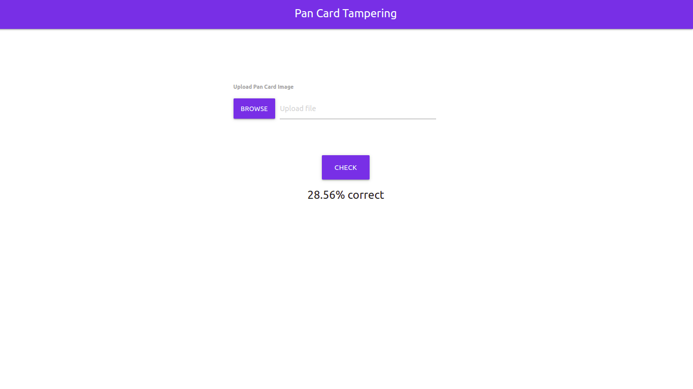

# Pan Card Tempering Detector

- Python 3
- Flask
- OpenCV
- PIL

---

# Installation on Linux and Unix like OS

- `git clone https://github.com/lenargasimov/pan-card-tampering.git`
- `cd pan-card-tampering`
- `python3 -m pip install -r requirements.txt`
- `python3 main.py`

# Instalation on Windows

- `git clone https://github.com/lenargasimov/pan-card-tampering.git`
- `cd pan-card-tampering`
- `python -m pip install -r requirements.txt`
- `python main.py`
